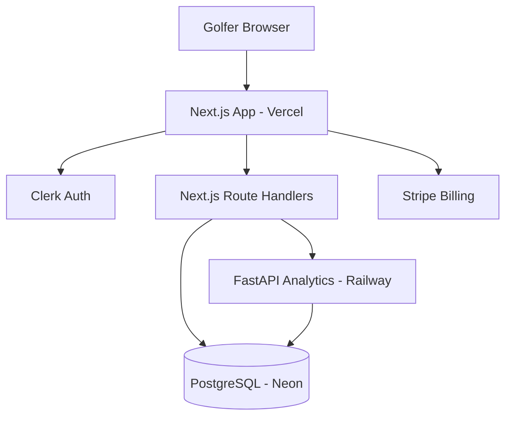

# BirdieIQ — Phase 1 Workplan

**Owner:** Wilson Papilla  
**Product:** BirdieIQ — AI golf coach from historical round data  
**Phase 1 goal:** Validate 18Birdies access path, lock architecture + data model, define metrics/rules engines, ship MVP in 8 weeks  
**How to use this doc:** Work checkpoints **in order**. Do not skip ahead. At each checkpoint, complete procedures, fill the **Journal** section, and meet **Exit criteria** before starting the next.

---

## Executive summary (CTO stance)

| Area | Decision |
|------|----------|
| **18Birdies API** | No public developer API or OAuth today. Official help docs state **no CSV export**. Treat live 18Birdies sync as **Phase 2** after partner/GDPR path or alternate source. |
| **MVP ingestion** | **BirdieIQ Round Import v1**: structured CSV template + guided manual round entry + (parallel) business development email to 18Birdies + GDPR portability test for one account. |
| **Frontend** | Next.js 14 (App Router) + React + Tailwind + shadcn/ui |
| **API layer** | Next.js Route Handlers (BFF) + **FastAPI** Python service for analytics |
| **Database** | PostgreSQL (Neon serverless) |
| **Auth** | **Deferred post-MVP** (Clerk) — MVP uses seeded single user ([ADR-007](./DECISIONS.md)) |
| **Billing** | **Deferred post-MVP** (Stripe) |
| **Hosting** | Vercel (web) + Railway or Render (Python API) — low cost, scale later |
| **Analytics v1** | Rules-based recommendations in Python; **no ML** in MVP |
| **Business model** | Subscription SaaS; responsive web first |

**Critical path:** CP-1 (feasibility) → CP-2 (architecture) → CP-3 (schema) → CP-4 (metrics spec) → CP-5 (rules spec) → CP-6 (repo scaffold) → CP-7–CP-14 (8-week build).

---

## Checkpoint map

| ID | Name | Type | Est. duration | Hard stop? |
|----|------|------|---------------|------------|
| **CP-0** | Project conventions & doc setup | Setup | 0.5 day | Yes |
| **CP-1** | Data access feasibility report | Discovery | 2–3 days | Yes |
| **CP-2** | MVP architecture | Design | 1–2 days | Yes |
| **CP-3** | Data model (ERD + SQL) | Design | 1–2 days | Yes |
| **CP-4** | Core metrics engine spec | Design | 2 days | Yes |
| **CP-5** | Recommendation engine v1 spec | Design | 1–2 days | Yes |
| **CP-6** | Monorepo scaffold + CI | Build | 2–3 days | Yes |
| **CP-7** | Week 1–2 — Auth, users, import | Build | 2 weeks | Yes |
| **CP-8** | Week 3–4 — Rounds, holes, shots | Build | 2 weeks | Yes |
| **CP-9** | Week 5 — Metrics pipeline | Build | 1 week | Yes |
| **CP-10** | Week 6 — Insights + trends UI | Build | 1 week | Yes |
| **CP-11** | Week 7 — Practice plans + rules | Build | 1 week | Yes |
| **CP-12** | Week 8 — Billing, polish, launch prep | Build | 1 week | Yes |
| **CP-13** | Beta launch checklist | Release | 2–3 days | Yes |
| **CP-14** | Post-MVP backlog (18Birdies sync) | Planning | 1 day | Optional |

---

## Standard task format (use in every sub-task)

When you complete any numbered procedure below, record:

```markdown
### Task: [ID] — [Title]
- **Status:** Not started | In progress | Blocked | Done
- **Date completed:**
- **Recommendation:** [what we chose]
- **Why:** [reason]
- **Alternatives:** [what we rejected]
- **Risks:** [what could go wrong]
- **Next action:** [immediate follow-up]
- **Evidence / links:** [URLs, screenshots, PRs, commit SHAs]
- **Notes:** [freeform journal]
```

Copy this block into `docs/journal/CP-XX.md` (create per checkpoint).

---

# CP-0 — Project conventions & documentation

**Goal:** One place for decisions, journals, and templates so every stop/start is traceable.

## Procedures

| Step | Action | Output |
|------|--------|--------|
| 0.1 | Create folders: `docs/journal/`, `docs/specs/`, `docs/diagrams/` | Folder structure |
| 0.2 | Copy journal template → `docs/journal/_TEMPLATE.md` | Reusable journal file |
| 0.3 | Add `docs/DECISIONS.md` — log major choices (ADR style, 1 paragraph each) | Decision log |
| 0.4 | Add `docs/specs/00-INDEX.md` linking all spec deliverables | Spec index |
| 0.5 | Commit: `docs: add phase 1 workplan and documentation structure` | Git checkpoint |

## Exit criteria

- [x] `docs/PHASE1_WORKPLAN.md` exists (this file)
- [x] `docs/journal/` ready for CP-1 journal
- [x] Team agrees: **no feature code** until CP-1–CP-5 docs are done (unless spike is time-boxed & noted in journal) — see [CONVENTIONS.md](./CONVENTIONS.md)

## Journal file

[CP-00.md](./journal/CP-00.md) — **completed** 2026-05-22

---

# CP-1 — Validate data access (18Birdies & fallbacks)

**Goal:** Written feasibility report with a **single recommended ingestion strategy** for MVP and a **Phase 2** path for 18Birdies.

**Deliverable:** `docs/specs/01-data-access-feasibility.md`

## Known facts (pre-research — verify in 0.1)

- 18Birdies consumer app: GPS, scorecard, stats, strokes gained (premium), shot tracking — **no public API docs**
- Help center: [Cannot export to CSV](https://help.18birdies.com/article/643-can-i-export-18birdies-data-to-a-csv-or-excel-spreadsheet) (Aug 2022)
- “Birdie API” at birdie.so is **unrelated** to 18Birdies golf app
- 18Birdies for Business / Community Builder exists — potential **partnership** channel, not OAuth

## Procedures

| Step | Action | Output |
|------|--------|--------|
| 1.1 | Search: `18Birdies API`, `developer`, `OAuth`, `partner`, `GDPR`, `data portability` | Search log in journal |
| 1.2 | Document endpoints needed vs availability: rounds, shots, scoring, clubs, profile | Gap table |
| 1.3 | Test **GDPR/CCPA portability** flow (one account): request data export; record timeline & format | Real sample or “pending” status |
| 1.4 | Test **email scorecard** flow: what fields appear? Enough for hole-level stats? | Sample redacted scorecard |
| 1.5 | Evaluate fallbacks (score each 1–5 on feasibility, legal risk, UX): | |
| | • Manual round entry (hole-by-hole) | |
| | • BirdieIQ CSV import template | |
| | • OCR / screenshot import | |
| | • Browser extension (read DOM/network) | |
| | • Scraping mobile API (reverse engineering) | |
| | • Partner API / B2B deal | |
| 1.6 | Research **alternate sources** for same metrics: Arccos, Garmin Golf, The Grint, GHIN, Golfshot — public API? export? | Comparison table |
| 1.7 | Draft report sections: Executive summary, Findings, Recommended MVP path, Phase 2 path, Open questions | `01-data-access-feasibility.md` |
| 1.8 | Send **partnership inquiry** (optional but recommended): business@ / via 18birdies.com/for-business | Email copy in journal |
| 1.9 | Review meeting: you + CTO (agent) sign off on strategy | Sign-off date in journal |

### Task CP-1 — Recommended MVP ingestion (decisive default)

| Field | Content |
|-------|---------|
| **Recommendation** | **Dual path:** (A) BirdieIQ **CSV Import v1** + **manual round wizard** for MVP demos and paying users without 18Birdies; (B) parallel **partner + GDPR** track for 18Birdies. Do **not** ship scraping/extension in MVP. |
| **Why** | Fastest legal path to value; you control schema; 18Birdies integration is blocked externally |
| **Alternatives** | Scrape/extension (high ToS/legal risk); wait for API (indefinite delay); OCR only (fragile) |
| **Risks** | Users expect “Connect 18Birdies” on landing page — set expectations; manual entry friction |
| **Next action** | Define CSV columns in CP-3 aligned to metrics in CP-4 |

## Exit criteria

- [x] Feasibility report complete with gap table + recommendation
- [x] Portability or scorecard: **pending user tests** documented ([CP-01 journal](./journal/CP-01.md)) — does not block MVP
- [x] MVP ingestion path **approved** — [ADR-001](./DECISIONS.md) accepted 2026-05-22

## Journal file

[CP-01.md](./journal/CP-01.md) — **completed** 2026-05-22

---

# CP-2 — Define MVP architecture

**Goal:** Architecture diagram + stack + hosting + auth — ready for implementation.

**Deliverable:** `docs/specs/02-architecture.md` + `docs/diagrams/architecture.mmd`

## Procedures

| Step | Action | Output |
|------|--------|--------|
| 2.1 | Draw C4 **Context** + **Container** diagrams (user, BirdieIQ web, API, DB, analytics, Clerk, Stripe) | `.mmd` or image |
| 2.2 | Define request flows: login → import round → compute metrics → show insights → generate practice plan | Sequence notes |
| 2.3 | Choose sync vs async for metrics (recommend: **async job** after import) | ADR-002 |
| 2.4 | Document environments: local, preview (Vercel), production | Env table |
| 2.5 | Estimate monthly cost at 0 / 100 / 1k users | Cost table |
| 2.6 | Security baseline: RLS or app-level tenant isolation, PII map, secrets | Security section |

### Task CP-2 — Stack (decisive default)

| Field | Content |
|-------|---------|
| **Recommendation** | **Next.js 14** (App Router) + **Route Handlers** as BFF; **FastAPI** Python service (`services/analytics`); **PostgreSQL** on **Neon**; **Vercel** + **Railway**; auth/billing **post-MVP** ([ADR-007](./DECISIONS.md)) |
| **Why** | Next.js matches PRD; Python best for stats/rules; ship analytics engine before SaaS plumbing |
| **Alternatives** | All-Python Django (slower frontend iteration); Supabase-only (couples auth+DB); Node-only analytics (weaker stats ecosystem) |
| **Risks** | Two runtimes to deploy; mitigate with Docker Compose locally + shared OpenAPI client |
| **Next action** | CP-6 scaffold monorepo to match |

### Reference architecture (Mermaid)



## Exit criteria

- [x] Architecture doc approved — [02-architecture.md](./specs/02-architecture.md)
- [x] ADR-002, ADR-003, ADR-006 accepted in [DECISIONS.md](./DECISIONS.md)
- [x] Diagram committed — [architecture.mmd](./diagrams/architecture.mmd)

## Journal file

[CP-02.md](./journal/CP-02.md) — **completed** 2026-05-22

---

# CP-3 — Design data model

**Goal:** ERD + PostgreSQL schema draft for all core entities.

**Deliverable:** `docs/specs/03-data-model.md` + `docs/diagrams/erd.mmd` + `db/migrations/001_initial.sql` (draft)

## Entities (required)

| Entity | Purpose |
|--------|---------|
| `users` | App user linked to Clerk `sub` |
| `rounds` | One played round (course, date, tee, total score) |
| `holes` | Per-hole score, putts, FIR, GIR, penalties |
| `shots` | Optional shot-level (club, lie, distance) — nullable for MVP |
| `practice_plans` | Generated plan header |
| `practice_plan_items` | Drills / focus areas |
| `insights` | Rule-fired insight records |
| `trend_snapshots` | Point-in-time metric aggregates |

## Procedures

| Step | Action | Output |
|------|--------|--------|
| 3.1 | ERD with cardinality (1:N user→rounds, 1:N round→holes, etc.) | `erd.mmd` |
| 3.2 | Define PKs (UUID v7 or ULID), FKs, `ON DELETE` rules | Schema doc |
| 3.3 | Indexes: `(user_id, played_at)`, `(round_id)`, `(user_id, metric_key, snapshot_date)` | Index list |
| 3.4 | Multi-tenancy: every table has `user_id`; enforce in queries | RLS or middleware rule |
| 3.5 | `import_batches` table for CSV audit trail | Import traceability |
| 3.6 | Write SQL migration draft | `001_initial.sql` |
| 3.7 | Map CSV columns (CP-1) → tables | Import mapping table in spec |

### Task CP-3 — Schema stance

| Field | Content |
|-------|---------|
| **Recommendation** | Normalize rounds/holes; shots **optional** child table; JSONB `raw_payload` on rounds for future 18Birdies sync |
| **Why** | MVP works without shot tracking; preserves upstream data later |
| **Alternatives** | Document DB (Mongo) — worse for relational stats |
| **Risks** | Over-modeling shots before data exists — gate shot UI behind import quality |
| **Next action** | CP-4 lists required fields per metric |

## Exit criteria

- [ ] ERD + SQL draft reviewed
- [ ] Import mapping documented
- [ ] ADR-004 in decision log

## Journal file

`docs/journal/CP-03.md`

---

# CP-4 — Core metrics engine spec

**Goal:** Formulas, inputs, edge cases for every MVP metric.

**Deliverable:** `docs/specs/04-metrics-engine.md`

## Metrics (MVP required)

| Metric | Priority |
|--------|----------|
| Scoring average (rolling windows) | P0 |
| Handicap trend (differential-based approximation) | P0 |
| Fairways hit % | P0 |
| GIR % | P0 |
| Putting average / trends | P0 |
| Strokes gained (approximation buckets) | P1 |
| Volatility (std dev of scores) | P1 |
| Scoring leaks (par breakdown, blow-up holes) | P0 |

## Procedures

| Step | Action | Output |
|------|--------|--------|
| 4.1 | For each metric: **formula**, **minimum data**, **window** (last 5/10/20/90d) | Metric table |
| 4.2 | Edge cases: partial 9-hole rounds, missing FIR/GIR, picked up holes, tournament vs casual | Edge case matrix |
| 4.3 | Define `trend_snapshots` computation schedule (on import + nightly) | Job spec |
| 4.4 | Define API contract: `GET /metrics/summary`, `GET /metrics/trends` | OpenAPI stub in spec |
| 4.5 | Unit test examples (given fixture rounds → expected metrics) | 5+ worked examples |
| 4.6 | Strokes gained MVP: use broad buckets (OTT/APP/ARG/PUTT) vs field or par baseline | ADR-005 |

### Task CP-4 — Handicap & SG stance

| Field | Content |
|-------|---------|
| **Recommendation** | Handicap: **WHS-style simplified** from last 20 score differentials; SG: **par-based proxy** until benchmark data exists |
| **Why** | Good enough for coaching insights; avoids PGA Tour data licensing |
| **Alternatives** | Full GHIN integration (requires API partnership) |
| **Risks** | Numbers won’t match 18Birdies exactly — disclose in UI |
| **Next action** | Implement in CP-9 Python module `metrics/` |

## Exit criteria

- [ ] Every P0 metric has formula + fixtures
- [ ] OpenAPI stub agreed between Next BFF and FastAPI

## Journal file

`docs/journal/CP-04.md`

---

# CP-5 — Recommendation engine v1 (rules)

**Goal:** Rules engine design + **20 starter rules** with triggers and practice outputs.

**Deliverable:** `docs/specs/05-recommendation-engine.md`

## Procedures

| Step | Action | Output |
|------|--------|--------|
| 5.1 | Choose engine pattern: **YAML/JSON rules** → Python evaluator → `insights` + `practice_plans` | Engine design |
| 5.2 | Rule schema: `id`, `condition`, `priority`, `insight_text`, `practice_template_id`, `cooldown_days` | Schema |
| 5.3 | Write **20 rules** (see starter set below) | Rule library |
| 5.4 | Conflict resolution: highest priority wins; max 3 active insights | Policy |
| 5.5 | Practice plan templates: 5–10 drill library referenced by rules | Template table |
| 5.6 | Dry-run: fixture user metrics → expected insights | Test cases |

### Starter rules (implement in spec — expand prose per rule)

| # | Condition (summary) | Recommendation |
|---|---------------------|----------------|
| R01 | Make % inside 6ft < 75% | Short putt gate drill |
| R02 | 3-putt rate > 15% | Lag putting ladder |
| R03 | GIR % dropped >10% vs prior window | Wedge GIR challenge |
| R04 | FIR % < 45% | Fairway finder driver drill |
| R05 | Penalties per round > 2 | Course management session |
| R06 | Score on par 5 > par+1 avg | Lay-up strategy practice |
| R07 | Double+ holes > 3 per round | Damage control routine |
| R08 | Putting avg > 34 | Putting clock drill |
| R09 | Missed GIR inside 100y > 40% | Wedge distance matrix |
| R10 | Blow-up hole (≥+3) in last 3 rounds | Mental reset + tee strategy |
| R11 | Back nine avg > front nine + 2 | Stamina / hydration + pace plan |
| R12 | Par 3 scoring > +0.5 vs par 4/5 | Tee club selection par 3 |
| R13 | Sand save proxy < 20% | Bunker entry drill |
| R14 | Up-and-down proxy < 30% | Chipping to 3ft drill |
| R15 | Volatility increased 20% | Consistency routine |
| R16 | Scoring avg trending up 3 rounds | Full bag audit session |
| R17 | Best club proximity variance high | Gapping session on range |
| R18 | Recent round without shot data | Enable shot tracking reminder |
| R19 | < 5 rounds in system | Import/history onboarding |
| R20 | All metrics stable | Maintenance plan (rotate skills) |

### Task CP-5 — Engine stance

| Field | Content |
|-------|---------|
| **Recommendation** | **Deterministic rules** in version-controlled YAML; no ML |
| **Why** | Explainable, fast, debuggable — matches PRD |
| **Alternatives** | LLM-generated tips (add later as layer, not core) |
| **Risks** | Rule fatigue — use cooldowns + max active insights |
| **Next action** | CP-11 implement evaluator |

## Exit criteria

- [ ] 20 rules documented with thresholds
- [ ] 3+ dry-run examples pass on paper

## Journal file

`docs/journal/CP-05.md`

---

# CP-6 — Monorepo scaffold + CI (build starts here)

**Goal:** Runnable skeleton matching CP-2 architecture.

**Deliverable:** Working local dev environment + empty DB migrated.

## Repository layout (target)

```
BirdieIQ/
├── apps/web/                 # Next.js
├── services/analytics/       # FastAPI
├── packages/shared/          # Types, OpenAPI client (optional)
├── db/migrations/
├── docs/
└── docker-compose.yml
```

## Procedures

| Step | Action | Output |
|------|--------|--------|
| 6.1 | Init monorepo (pnpm workspaces or turborepo) | `package.json` root |
| 6.2 | Scaffold Next.js + Tailwind + shadcn | `apps/web` runs |
| 6.3 | Scaffold FastAPI + uv/poetry | `services/analytics` runs |
| 6.4 | Docker Compose: Postgres local + optional analytics | `docker-compose.yml` |
| 6.5 | Apply `001_initial.sql` via migration tool (Drizzle or Prisma — pick one in journal) | DB tables |
| 6.6 | `.env.example` with `BIRDIEIQ_DEFAULT_USER_ID` + seed user migration | Default user works locally |
| 6.7 | GitHub Actions: lint + test on PR | CI green |
| 6.8 | Deploy preview: Vercel + Railway hello-world | URLs in journal |

## Exit criteria

- [ ] `pnpm dev` (or documented command) starts web
- [ ] FastAPI `/health` returns 200
- [ ] Migrations apply cleanly
- [ ] CI passing on `main`

## Journal file

`docs/journal/CP-06.md`

---

# CP-7 to CP-12 — 8-week MVP build (engineering milestones)

Work **one week per checkpoint** (CP-7 = weeks 1–2, etc.). Each week ends with demo + journal + git tag `v0.X-weekN`.

## Week 1–2 — CP-7: Foundation (import + dashboard)

| Milestone | Tasks |
|-----------|-------|
| M1.1 | Seed `users` row + `getCurrentUserId()` helper (ADR-007) |
| M1.2 | Dashboard shell (mobile-responsive nav) |
| M1.3 | CSV import UI + validation + `import_batches` |
| M1.4 | Manual round wizard (18 holes, score/putts/FIR/GIR) |
| M1.5 | Round list + round detail (read-only) |

**Risks:** Import edge cases — time-box validation rules  
**Dependency:** CP-3 schema, CP-1 CSV format  
**Demo:** Open app → import CSV → see round list (no login)

### Exit criteria

- [ ] E2E: open dashboard → import → view round
- [ ] Tag: `v0.1-foundation`

---

## Week 3–4 — CP-8: Round domain complete

| Milestone | Tasks |
|-----------|-------|
| M2.1 | CRUD holes/shots (shots optional) |
| M2.2 | Edit/delete round |
| M2.3 | Course name + tee metadata |
| M2.4 | Empty states + onboarding checklist |
| M2.5 | Basic error handling + loading states |

**Demo:** Full manual round entry without CSV

### Exit criteria

- [ ] 18-hole round editable end-to-end
- [ ] Tag: `v0.2-rounds`

---

## Week 5 — CP-9: Metrics pipeline

| Milestone | Tasks |
|-----------|-------|
| M3.1 | FastAPI `metrics` module per CP-4 |
| M3.2 | Job trigger on import/save round |
| M3.3 | Persist `trend_snapshots` |
| M3.4 | BFF endpoints for dashboard metrics |
| M3.5 | Unit tests for P0 metrics |

**Demo:** Dashboard shows scoring avg, FIR%, GIR%, putting

### Exit criteria

- [ ] Metrics match fixture tests from CP-4
- [ ] Tag: `v0.3-metrics`

---

## Week 6 — CP-10: Insights & trends UI

| Milestone | Tasks |
|-----------|-------|
| M4.1 | Trends charts (last 5/10/20 rounds) |
| M4.2 | Strengths / weaknesses summary cards |
| M4.3 | Scoring leaks visualization (par type, holes) |
| M4.4 | Volatility indicator |

**Demo:** User sees trends and “where you leak strokes”

### Exit criteria

- [ ] All P0 metrics visible in UI
- [ ] Tag: `v0.4-insights`

---

## Week 7 — CP-11: Practice plans + rules engine

| Milestone | Tasks |
|-----------|-------|
| M5.1 | YAML rules loader + evaluator (CP-5) |
| M5.2 | Generate `insights` on metrics refresh |
| M5.3 | Practice plan page with drill detail |
| M5.4 | Mark plan complete / dismiss insight |
| M5.5 | Implement 20 starter rules |

**Demo:** Import triggers insight + personalized plan

### Exit criteria

- [ ] ≥15 of 20 rules firing correctly on test personas
- [ ] Tag: `v0.5-coach`

---

## Week 8 — CP-12: MVP polish & deploy

| Milestone | Tasks |
|-----------|-------|
| M6.1 | Landing page + positioning (honest 18Birdies messaging) |
| M6.2 | Empty states, mobile polish, error boundaries |
| M6.3 | Sentry/logging + basic observability |
| M6.4 | Deploy to Vercel + Railway + Neon (staging) |
| M6.5 | Smoke test: import → metrics → insights → practice plan |
| ~~M6.x~~ | ~~Stripe / paywall~~ — **deferred** ([ADR-007](./DECISIONS.md)) |

**Demo:** Full coaching flow on staging URL (single-user MVP)

### Exit criteria

- [ ] E2E coaching flow on staging
- [ ] Tag: `v0.6-mvp`

---

# CP-13 — Beta launch checklist

| Step | Action |
|------|--------|
| 13.1 | 5 beta users complete import + view insights |
| 13.2 | Fix P0 bugs from feedback |
| 13.3 | Analytics: PostHog or Plausible events (signup, import, insight_view) |
| 13.4 | Support email + feedback form |
| 13.5 | Launch log in `docs/journal/CP-13.md` |

## Exit criteria

- [ ] MVP live on staging with ≥3 testers (auth not required for MVP)
- [ ] Known limitations doc published

---

# CP-14 — Post-MVP (18Birdies & automation backlog)

Only after CP-13:

| Priority | Item |
|----------|------|
| P1 | 18Birdies partnership follow-up |
| P2 | GDPR export parser (if format usable) |
| P3 | OAuth/integration if API becomes available |
| P4 | Browser-assisted import (evaluate legal) |
| P5 | Additional data sources (Garmin, Arccos, etc.) |
| P6 | LLM narrative layer on top of rules (not replacing) |
| P7 | **Clerk auth** — sign-up, protected routes, user sync ([ADR-007](./DECISIONS.md)) |
| P8 | **Stripe billing** — subscriptions, paywall, free tier limits |

---

## Technical risks register (maintain in journal)

| Risk | Impact | Mitigation |
|------|--------|------------|
| No 18Birdies API | High expectation mismatch | Clear marketing; CSV + manual; partnership track |
| Metric parity with 18Birdies | User distrust | “BirdieIQ estimates” disclaimer |
| Manual entry friction | Low activation | CSV template + quick 9-hole mode |
| Two-service ops complexity | Dev slowdown | Docker Compose; shared types; good README |
| Golf seasonality | Revenue timing | Beta in spring/summer; yearly plan option later |
| Stripe + Clerk config drift | Auth/billing bugs | Staging environment checklist |

---

## Constraints (non-negotiable for Phase 1)

- Speed to MVP over perfect data sync  
- Low infrastructure cost (<$50/mo until traction)  
- Mobile-responsive web only  
- Rules-based coaching only  
- Subscription SaaS **after** core MVP (auth + billing post CP-12)  
- Scalability via clean schema + async jobs, not premature microservices  

---

## What to do next (immediate)

1. **Today:** Complete **CP-0** (folders + journal template).  
2. **This week:** Complete **CP-1** feasibility report (highest risk item).  
3. **Do not scaffold code** until CP-1–CP-5 exit criteria are met (unless time-boxed spike noted in journal).

---

## Appendix A — Suggested journal template file

Create `docs/journal/_TEMPLATE.md`:

```markdown
# Checkpoint: CP-XX — [Name]

**Started:**
**Completed:**
**Owner:**

## Summary
[1–3 sentences]

## Tasks completed
| Task ID | Status | Notes |
|---------|--------|-------|

## Decisions made
-

## Blockers
-

## Commits / PRs
-

## Demo notes
-

## Next checkpoint
CP-XX
```

---

## Appendix B — 8-week calendar view

| Week | Checkpoint | Theme |
|------|------------|-------|
| 1 | CP-7 | Auth + import |
| 2 | CP-7 | Import + round list |
| 3 | CP-8 | Holes/shots CRUD |
| 4 | CP-8 | Round UX polish |
| 5 | CP-9 | Metrics engine |
| 6 | CP-10 | Insights UI |
| 7 | CP-11 | Rules + practice plans |
| 8 | CP-12 | Billing + launch |

**Design weeks (before code):** CP-1 through CP-5 can overlap calendar week 0–1 if full-time.

---

*Document version: 1.0 — Phase 1 workplan*
