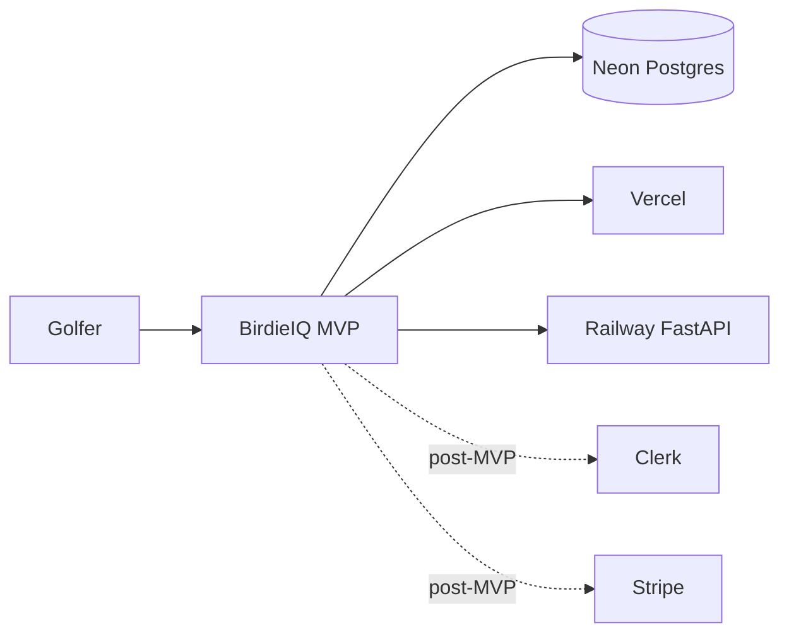

# 02 — MVP Architecture

**Status:** Complete (amended 2026-05-22)  
**Checkpoint:** CP-2  
**Date:** 2026-05-22  
**Sign-off:** Approved — ADR-002, ADR-003, ADR-007

**Diagrams:** [architecture.mmd](../diagrams/architecture.mmd)

---

## MVP scope boundary (amendment)

**In MVP build (CP-6–CP-12):** data import, rounds, metrics, insights, practice plans, deploy.  
**Deferred post-MVP:** Clerk authentication, Stripe billing, paywalls, multi-user signup.

MVP uses a **single seeded golfer** (`users` row + `BIRDIEIQ_DEFAULT_USER_ID` env). Schema keeps `clerk_id` and `subscription_status` nullable for later — no rework of tenant model.

See [ADR-007](../DECISIONS.md#adr-007--defer-auth-and-billing-post-mvp).

---

## 1. Architecture decision summary

| Field | Decision |
|-------|----------|
| **Recommendation** | Next.js 14 (App Router) on Vercel + Route Handlers (BFF); FastAPI analytics on Railway; PostgreSQL on Neon; **no Clerk/Stripe in MVP** |
| **Why** | Ship core product value first (analytics + coaching); auth/billing add complexity without validating the engine |
| **Alternatives** | Clerk + Stripe in week 1 — rejected for MVP scope |
| **Risks** | Do not deploy MVP to public internet without auth — local/staging only until post-MVP |
| **Next action** | CP-3 data model; CP-6 monorepo scaffold |

---

## 2. System context (C4 Level 1)

BirdieIQ is a **golf analytics web app** where golfers import or enter round data, receive computed metrics and trends, and get **rules-based** practice recommendations. Subscription/auth layers come **after** core MVP is validated.



**External dependencies (MVP):**

| System | Role | Critical? |
|--------|------|-----------|
| Neon | Primary data store | Yes |
| Vercel | Host Next.js | Yes |
| Railway | Host FastAPI analytics | Yes |
| Clerk | Authentication | **No — post-MVP** |
| Stripe | Subscriptions | **No — post-MVP** |
| 18Birdies | Data source | **No** (CSV/manual per ADR-001) |

---

## 3. Container architecture (C4 Level 2)

### 3.1 Containers

| Container | Technology | Responsibility |
|-----------|------------|----------------|
| **Web UI** | Next.js 14, React, Tailwind, shadcn/ui | Marketing, dashboard, import wizard, insights, practice plans |
| **BFF API** | Next.js Route Handlers (`app/api/**`) | Tenant-scoped CRUD (default user), job enqueue |
| **Analytics service** | FastAPI (Python 3.12+) | Metrics engine, trend snapshots, rules evaluator |
| **Database** | PostgreSQL 16 (Neon) | Users, rounds, holes, jobs, insights, plans |

### 3.2 What runs where

```
┌─────────────────────────────────────────────────────────────┐
│ Vercel                                                       │
│  apps/web                                                    │
│   ├── app/ (pages, layouts, RSC)                            │
│   └── app/api/ (BFF — auth, rounds, import, metrics read)   │
└──────────────────────────┬──────────────────────────────────┘
                           │ HTTPS + service secret
┌──────────────────────────▼──────────────────────────────────┐
│ Railway                                                      │
│  services/analytics                                          │
│   ├── POST /internal/jobs/metrics                           │
│   ├── GET  /health                                          │
│   └── (MVP) sync worker in-process OR asyncio background    │
└──────────────────────────┬──────────────────────────────────┘
                           │
┌──────────────────────────▼──────────────────────────────────┐
│ Neon PostgreSQL                                              │
└─────────────────────────────────────────────────────────────┘
```

### 3.3 Monorepo layout (CP-6 target)

```
BirdieIQ/
├── apps/web/                 # Next.js — UI + BFF
├── services/analytics/       # FastAPI — compute + rules
├── packages/shared/          # Shared types, constants (optional v1)
├── db/migrations/            # SQL migrations
├── docs/
└── docker-compose.yml        # Local Postgres + analytics
```

### 3.4 BFF vs analytics boundary

| Concern | Owner | Rationale |
|---------|-------|-----------|
| User-facing REST | BFF | CORS, rate limits; resolves `user_id` from default seed (MVP) |
| Round CRUD, import validation | BFF | Low latency; direct SQL via Drizzle/Prisma |
| Metrics computation | Analytics | Python/pandas-friendly; keeps rules testable |
| Rules engine | Analytics | YAML rules + unit tests in Python |
| Reading computed snapshots | BFF | Simple SELECT for dashboard |
| Stripe webhooks | BFF | **Post-MVP** |

**Internal call:** BFF → `POST https://analytics.<env>/internal/jobs/metrics` with header `X-BirdieIQ-Secret` and body `{ userId, jobId, trigger }`.

---

## 4. Core request flows

### 4.1 User context (MVP — no login)

1. Migration seeds one row in `users` (e.g. `display_name = 'Demo Golfer'`).
2. BFF helper `getCurrentUserId()` returns `process.env.BIRDIEIQ_DEFAULT_USER_ID` (set in `.env.example`).
3. All API routes scope data to that `user_id` — never accept `user_id` from the client in MVP.
4. UI goes straight to `/dashboard` — no sign-in screen.

**Post-MVP (ADR-007):** Replace helper with Clerk session; backfill `clerk_id` on existing users.

```ts
// MVP pattern (apps/web/lib/user.ts)
export function getCurrentUserId(): string {
  const id = process.env.BIRDIEIQ_DEFAULT_USER_ID;
  if (!id) throw new Error('BIRDIEIQ_DEFAULT_USER_ID not set');
  return id;
}
```

### 4.2 Import round (CSV) → metrics → insights

See sequence diagram in [architecture.mmd](../diagrams/architecture.mmd).

| Step | Component | Action |
|------|-----------|--------|
| 1 | UI | Upload CSV or submit wizard |
| 2 | BFF | Validate against import v1 schema; transactional insert |
| 3 | BFF | Create `metrics_jobs` row `status=pending` |
| 4 | BFF | Fire-and-forget call to Analytics (or queue poll) |
| 5 | Analytics | Load holes; compute metrics; write `trend_snapshots` |
| 6 | Analytics | Run rules → `insights`, `practice_plans` |
| 7 | Analytics | Set job `status=complete` |
| 8 | UI | Poll job or revalidate SWR; render dashboard |

**UX:** Show “Analyzing your round…” with job progress; target **&lt; 30s** for 50 rounds on MVP hardware.

### 4.3 Dashboard read path

- `GET /api/metrics/summary` — latest snapshots (BFF → DB only).
- `GET /api/insights` — active insights with cooldown filter.
- `GET /api/practice-plans/current` — active plan + items.

No Analytics call on read path (cacheable DB reads).

### 4.4 Subscription

**Deferred post-MVP.** No paywalls or round limits in MVP build. `users.subscription_status` column reserved for later.

---

## 5. Async metrics & jobs (ADR-002)

| Field | Decision |
|-------|----------|
| **Recommendation** | **Async job** after every import or round save; optional nightly refresh in v1.1 |
| **Why** | Metrics + 20 rules over many rounds can exceed serverless timeout; decouples UX |
| **Alternatives** | Sync in BFF request — rejected (timeout risk); separate queue service day 1 — overkill |
| **Risks** | Stale dashboard until job completes — mitigated with polling + optimistic “pending” badge |

### MVP job implementation

| Piece | Implementation |
|-------|----------------|
| State | `metrics_jobs` table: `id`, `user_id`, `status`, `trigger`, `error`, `created_at`, `completed_at` |
| Trigger | BFF inserts job then HTTP POST to Analytics |
| Worker | FastAPI `BackgroundTasks` or asyncio task (single Railway service) |
| Retry | 3 attempts with exponential backoff; dead-letter in `error` column |
| v1.1 | Railway cron or Inngest for nightly `trend_snapshots` refresh |

**Not in MVP:** Redis, SQS, separate worker dyno.

---

## 6. Environments

| Environment | Web | Analytics | Database |
|-------------|-----|-----------|----------|
| **Local** | `localhost:3000` | `localhost:8000` | Docker Postgres 16 |
| **Preview** | Vercel PR preview | Railway PR env (optional) | Neon branch |
| **Production** | `app.birdieiq.com` (TBD) | Railway prod | Neon main |

*Clerk and Stripe columns removed from MVP — add when ADR-007 is implemented.*

### Environment variables (MVP minimum)

| Variable | Where | Purpose |
|----------|-------|---------|
| `DATABASE_URL` | BFF, Analytics | Postgres connection |
| `BIRDIEIQ_DEFAULT_USER_ID` | BFF | Seeded user UUID for all requests |
| `ANALYTICS_URL` | BFF | Internal service base URL |
| `BIRDIEIQ_SERVICE_SECRET` | BFF + Analytics | Internal auth |

### Environment variables (post-MVP)

| Variable | Purpose |
|----------|---------|
| `CLERK_SECRET_KEY` / `NEXT_PUBLIC_CLERK_PUBLISHABLE_KEY` | Auth |
| `STRIPE_SECRET_KEY` / `STRIPE_WEBHOOK_SECRET` | Billing |

---

## 7. Hosting & cost estimate (ADR-003)

| Field | Decision |
|-------|----------|
| **Recommendation** | **Vercel** (Pro when needed) + **Railway** (Hobby/Starter) + **Neon** free → scale |
| **Why** | Best DX for Next.js; Railway simple Python deploy; Neon serverless Postgres aligns with variable load |
| **Alternatives** | Render (fine for Python); Fly.io (more ops); Supabase DB (acceptable but splits auth story) |
| **Risks** | Vendor sprawl — 3 bills; keep in one password manager doc |

### Monthly cost scenarios (USD, approximate)

| Scale | Vercel | Neon | Railway | **MVP total** |
|-------|--------|------|---------|---------------|
| **Dev / dogfood** | $0 | $0 | $5 | **~$5** |
| **Staging** | $0–20 | $0–19 | $5–10 | **~$5–30** |

*Add Clerk (~$25+ at scale) and Stripe fees when ADR-007 ships.*

Assumptions: hobby tiers, single Analytics instance, no dedicated cache, images on Vercel CDN.

**Cost guardrails:**

- MVP infra target **&lt; $30/mo** until auth/billing launch.
- Neon autoscaling pause on dev branches.
- Railway sleep on preview only.

---

## 8. Security baseline

### 8.1 Tenant isolation

| Layer | Approach |
|-------|----------|
| **Primary (MVP)** | Application-level: every query includes `WHERE user_id = $currentUser` |
| **Defense in depth (v1.1)** | Neon Row Level Security policies mirroring `user_id` |
| **Analytics** | Internal endpoints reject requests without valid service secret; `user_id` in body must match job record |

### 8.2 Authentication & authorization (MVP)

- **No public auth** — app assumes single seeded user; suitable for **local dev and private staging only**.
- Do **not** expose MVP to the open internet without adding Clerk (ADR-007).
- Analytics **not** browser-accessible — service secret header only.
- Admin routes: none.

**Post-MVP:** Clerk JWT in BFF middleware; webhook user sync.

### 8.3 PII map

| Data | Classification | Storage |
|------|----------------|---------|
| Display name | Low | `users` (seed) |
| Email | PII | Optional post-MVP / Clerk |
| Round locations (course names) | Low sensitivity | `rounds` |
| IP / analytics | Optional | PostHog/Plausible — CP-13 |
| Payment | — | **Post-MVP** (Stripe) |

### 8.4 Secrets management

- Production: Vercel env + Railway env (no secrets in repo).
- Local: `.env.local` gitignored; `.env.example` committed.

### 8.5 Transport & headers

- HTTPS everywhere.
- `Content-Security-Policy` on Vercel.
- CORS: Analytics rejects browser origins (server-to-server only).

---

## 9. API surface (MVP contract sketch)

### BFF (public, Clerk-protected)

| Method | Path | Purpose |
|--------|------|---------|
| GET | `/api/me` | Current user profile (no subscription in MVP) |
| GET | `/api/rounds` | List rounds |
| POST | `/api/rounds` | Manual round create |
| GET | `/api/rounds/[id]` | Round + holes |
| POST | `/api/rounds/import` | CSV import |
| GET | `/api/jobs/[id]` | Metrics job status |
| GET | `/api/metrics/summary` | Dashboard KPIs |
| GET | `/api/metrics/trends` | Time series |
| GET | `/api/insights` | Active insights |
| GET | `/api/practice-plans/current` | Active plan |
| POST | `/api/billing/checkout` | **Post-MVP** |
| POST | `/api/webhooks/clerk` | **Post-MVP** |
| POST | `/api/webhooks/stripe` | **Post-MVP** |

### Analytics (internal)

| Method | Path | Purpose |
|--------|------|---------|
| GET | `/health` | Probe |
| POST | `/internal/jobs/metrics` | Run metrics + rules for `user_id` |

OpenAPI generated from FastAPI in CP-6.

---

## 10. Observability (MVP minimum)

| Signal | Tool | When |
|--------|------|------|
| Errors | Sentry (web + API) | CP-12 |
| Logs | Vercel / Railway stdout | CP-6 |
| Uptime | Better Stack or free ping | CP-12 |
| Product analytics | PostHog or Plausible | CP-13 |

---

## 11. Scalability path (post-MVP)

| Trigger | Action |
|---------|------|
| Job backlog &gt; 1 min | Dedicated worker process on Railway |
| DB connections saturated | Neon pooler + Prisma/Drizzle pool limits |
| Rules complexity grows | Versioned rule packs; feature flags |
| 18Birdies API exists | Ingestion adapter service; same job pipeline |
| Multi-region | Neon read replicas; Vercel edge — defer |

---

## 12. Technology stack reference

| Layer | Choice | Version note |
|-------|--------|--------------|
| Frontend | Next.js App Router | 14.x |
| UI | Tailwind + shadcn/ui | — |
| BFF | Route Handlers | — |
| Analytics | FastAPI + Pydantic | Python 3.12 |
| Stats | pandas/numpy (light use) | — |
| DB | PostgreSQL | 16 |
| ORM | Drizzle or Prisma | ADR-004 at CP-6 |
| Auth | Clerk | **Post-MVP** (ADR-007) |
| Payments | Stripe Billing | **Post-MVP** (ADR-007) |
| CI | GitHub Actions | lint + test |

---

## 13. Open items for CP-3 / CP-6

| Item | Owner checkpoint |
|------|------------------|
| Exact `metrics_jobs` + snapshot schema | CP-3 |
| Drizzle vs Prisma | CP-6 (ADR-004) |
| OpenAPI client codegen | CP-6 |
| Custom domain DNS | CP-12 |

---

## 14. Approval

| Role | Name | Date |
|------|------|------|
| Product / engineering | Wilson Papilla | 2026-05-22 |

**Approved for implementation** — proceed to CP-3 (data model).
