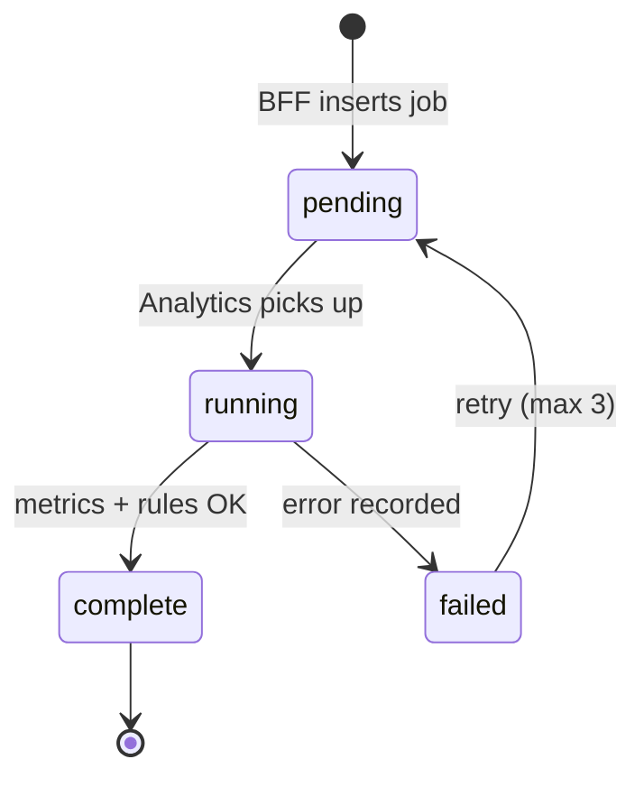

# 03 — Data Model

**Status:** Complete  
**Checkpoint:** CP-3  
**Date:** 2026-05-22  
**Sign-off:** Approved for CP-4 (metrics) and CP-6 (scaffold)

**Diagram:** [erd.mmd](../diagrams/erd.mmd)  
**Migration:** [db/migrations/001_initial.sql](../../db/migrations/001_initial.sql)  
**Workplan:** [PHASE1_WORKPLAN.md](../PHASE1_WORKPLAN.md#cp-3--design-data-model)

---

## 1. Schema decision summary

| Field | Decision |
|-------|----------|
| **Recommendation** | Normalized `rounds` + `holes`; optional `shots`; `raw_payload` JSONB on `rounds`; UUID PKs via `gen_random_uuid()`; app-level `user_id` on every tenant table |
| **Why** | MVP metrics need hole-level FIR/GIR/putts without shot tracking; preserves upstream blobs for Phase 2 18Birdies sync |
| **Alternatives** | Document store — poor for relational stats; embed holes in JSONB on rounds — harder to index and query |
| **Risks** | Over-investing in `shots` before data exists — UI gated until import quality supports it |
| **Next action** | CP-4 defines required fields per metric; CP-6 applies migration + seed user |

---

## 2. Entity overview

| Table | Purpose | MVP usage |
|-------|---------|-----------|
| `users` | Golfer account | Single seeded row (ADR-007) |
| `import_batches` | CSV upload audit trail | CP-7 import UI |
| `rounds` | One played round | CSV + manual wizard |
| `holes` | Per-hole stats | Required for P0 metrics |
| `shots` | Shot-level detail | Schema only; UI optional |
| `metrics_jobs` | Async compute queue | ADR-002 |
| `trend_snapshots` | Precomputed metric aggregates | Dashboard read path |
| `insights` | Rule-fired coaching messages | CP-11 |
| `practice_plans` | Generated plan header | CP-11 |
| `practice_plan_items` | Drills / focus areas | CP-11 |

---

## 3. ERD

See [erd.mmd](../diagrams/erd.mmd). Cardinality:

| Relationship | Cardinality | ON DELETE |
|--------------|-------------|-----------|
| user → rounds | 1:N | CASCADE |
| user → import_batches | 1:N | CASCADE |
| import_batch → rounds | 1:N | SET NULL on batch |
| round → holes | 1:N | CASCADE |
| hole → shots | 1:N | CASCADE |
| user → metrics_jobs | 1:N | CASCADE |
| user → trend_snapshots | 1:N | CASCADE |
| user → insights | 1:N | CASCADE |
| insight → practice_plan | 0:1 | SET NULL on insight |
| practice_plan → items | 1:N | CASCADE |

---

## 4. Primary keys & identifiers

| Choice | Detail |
|--------|--------|
| **PK type** | `UUID` with `gen_random_uuid()` (PostgreSQL `pgcrypto`) |
| **Rationale** | Safe across BFF + Analytics; no sequential leak; works with Neon |
| **Future** | CP-6 may adopt UUID v7/ULID in application layer; column type stays UUID |
| **Dedup** | `rounds.(user_id, external_round_id)` unique when `external_round_id` set (CSV `round_id`) |

---

## 5. Multi-tenancy

Every table that holds user-owned data includes `user_id` (directly or via parent with denormalized copy on `holes` and `shots`).

| Rule | Implementation |
|------|----------------|
| **MVP** | BFF resolves `user_id` from `BIRDIEIQ_DEFAULT_USER_ID`; never trust client-supplied `user_id` |
| **Queries** | All SELECT/UPDATE/DELETE include `WHERE user_id = $current` |
| **Inserts** | BFF sets `user_id` server-side; `holes.user_id` copied from parent round on write |
| **v1.1** | Neon Row Level Security policies mirroring `user_id` (defense in depth) |

---

## 6. Table reference

### 6.1 `users`

| Column | Type | Nullable | Notes |
|--------|------|----------|-------|
| `id` | UUID | PK | Default `gen_random_uuid()` |
| `clerk_id` | TEXT | yes | Unique when set — post-MVP |
| `email` | TEXT | yes | Post-MVP / Clerk sync |
| `display_name` | TEXT | no | MVP seed: e.g. `Demo Golfer` |
| `subscription_status` | TEXT | yes | Post-MVP Stripe |
| `created_at` / `updated_at` | TIMESTAMPTZ | no | Auto-maintained on update |

### 6.2 `import_batches`

| Column | Type | Notes |
|--------|------|-------|
| `source_format` | TEXT | Default `birdieiq_csv_v1` |
| `status` | enum | `pending` → `processing` → `complete` \| `failed` |
| `rows_total` | INT | Rows parsed from file |
| `rounds_created` | INT | Distinct rounds inserted |

### 6.3 `rounds`

| Column | Type | Notes |
|--------|------|-------|
| `played_at` | DATE | Local course date (no timezone math in v1) |
| `round_type` | SMALLINT | `9` or `18` |
| `total_score` | SMALLINT | Optional; sum of hole scores when omitted |
| `source` | enum | `csv`, `manual`, `api` (future) |
| `raw_payload` | JSONB | Full upstream record for Phase 2 parsers |
| `external_round_id` | TEXT | CSV `round_id`; dedup key per user |

### 6.4 `holes`

| Column | Type | Notes |
|--------|------|-------|
| `hole_number` | SMALLINT | 1–18; unique per round |
| `par` | SMALLINT | 3–6 |
| `score` | SMALLINT | NULL = picked up / incomplete |
| `putts` | SMALLINT | NULL allowed if unknown |
| `fairway_hit` | TEXT | `Y`, `N`, `NA` |
| `gir` | BOOLEAN | NULL = unknown |
| `penalty_strokes` | SMALLINT | Default 0 |

**Par 3 / fairway:** Importer sets `fairway_hit = 'NA'` when not applicable.

### 6.5 `shots` (optional)

Child of `holes`. Not required for P0 metrics (CP-4). Reserved for future shot-tracking import and R18 rule (“enable shot tracking”).

### 6.6 `metrics_jobs` (ADR-002)

| Column | Type | Notes |
|--------|------|-------|
| `status` | enum | `pending`, `running`, `complete`, `failed` |
| `trigger` | enum | `import`, `round_save`, `manual`, `nightly` |
| `error` | TEXT | Last failure message; retry policy in Analytics |

Worker loads all rounds for `user_id` on job run (not single-round scoped in MVP).

### 6.7 `trend_snapshots`

| Column | Type | Notes |
|--------|------|-------|
| `metric_key` | TEXT | Stable key — defined in CP-4 (e.g. `scoring_avg`) |
| `window_label` | TEXT | e.g. `last_5`, `last_10`, `last_20`, `last_90d` |
| `value_numeric` | NUMERIC | Primary scalar value |
| `value_json` | JSONB | Complex breakdowns (e.g. par-type leaks) |
| `as_of_date` | DATE | Snapshot effective date |
| **Unique** | | `(user_id, metric_key, window_label, as_of_date)` |

### 6.8 `insights`

| Column | Type | Notes |
|--------|------|-------|
| `rule_id` | TEXT | e.g. `R01` … `R20` (CP-5) |
| `priority` | SMALLINT | Higher wins conflicts; max 3 active (CP-5 policy) |
| `status` | enum | `active`, `dismissed`, `expired` |
| `cooldown_until` | TIMESTAMPTZ | Suppress re-fire until elapsed |
| `context` | JSONB | Metric values at fire time |

### 6.9 `practice_plans` / `practice_plan_items`

Plan optionally links to `source_insight_id`. Items ordered by `sort_order`; reference `drill_template_id` from CP-5 template library.

---

## 7. Indexes

| Index | Table | Columns | Purpose |
|-------|-------|---------|---------|
| `idx_rounds_user_played_at` | rounds | `(user_id, played_at DESC)` | Round list, date filters |
| `idx_holes_round_id` | holes | `(round_id)` | Round detail |
| `idx_trend_snapshots_user_metric` | trend_snapshots | `(user_id, metric_key, as_of_date DESC)` | Dashboard KPIs |
| `idx_insights_user_status` | insights | `(user_id, status, fired_at DESC)` | Active insights |
| `idx_metrics_jobs_user_created` | metrics_jobs | `(user_id, created_at DESC)` | Job polling |
| `idx_import_batches_user_created` | import_batches | `(user_id, created_at DESC)` | Import history |

Partial index on `metrics_jobs` where `status IN ('pending', 'running')` for worker dequeue (optional MVP).

---

## 8. CSV import mapping (BirdieIQ Round Import v1)

**Template:** [birdieiq-round-import-v1.example.csv](./birdieiq-round-import-v1.example.csv)

One CSV row = one hole. Rows sharing the same `round_id` become one `rounds` row + N `holes` rows.

| CSV column | DB target | Transform |
|------------|-----------|-----------|
| `round_id` | `rounds.external_round_id` | Required for dedup; same value groups holes |
| `played_at` | `rounds.played_at` | Parse ISO date `YYYY-MM-DD` |
| `course_name` | `rounds.course_name` | Trim; required |
| `tee_name` | `rounds.tee_name` | Optional |
| `round_type` | `rounds.round_type` | `9` or `18` (integer) |
| — | `rounds.source` | Always `'csv'` |
| — | `rounds.import_batch_id` | Set from current batch |
| — | `rounds.user_id` | BFF default user |
| `hole_number` | `holes.hole_number` | 1–18 |
| `par` | `holes.par` | Integer |
| `score` | `holes.score` | Empty → NULL (picked up) |
| `putts` | `holes.putts` | Empty → NULL |
| `fairway_hit` | `holes.fairway_hit` | `Y`/`N`/`NA` (case-insensitive); invalid → validation error |
| `gir` | `holes.gir` | `Y`→true, `N`→false, empty→NULL |
| `penalty_strokes` | `holes.penalty_strokes` | Default 0 |
| `notes` | `holes.notes` | Optional |
| — | `holes.user_id` | Copy from round |

**Not in CSV (computed or omitted):**

| Field | Handling |
|-------|----------|
| `rounds.total_score` | Sum of hole `score` when all holes have scores; else NULL |
| `rounds.raw_payload` | Optional: store original CSV row array per round in JSONB |
| `shots` | Not populated from CSV v1 |

**Dedup on re-import:** If `(user_id, external_round_id)` exists, reject or upsert — **recommend reject with clear error** in MVP (upsert in v1.1).

**Validation rules (BFF, CP-7):**

- All holes for a `round_id` share same `played_at`, `course_name`, `tee_name`, `round_type`
- Hole count matches `round_type` (9 or 18) or allow partial with flag (CP-4 edge cases)
- `fairway_hit` required on par 4/5; `NA` allowed on par 3

---

## 9. Manual round wizard mapping

Same `holes` columns. `rounds.source = 'manual'`. `external_round_id` NULL unless user supplies external reference.

---

## 10. Metrics job lifecycle

On `complete`, Analytics writes `trend_snapshots`, upserts `insights`, may create `practice_plans`.

---

## 11. ADR touchpoints

| ADR | How schema supports it |
|-----|------------------------|
| ADR-001 | CSV + manual via `rounds.source`, `import_batches` |
| ADR-002 | `metrics_jobs` table |
| ADR-007 | `users` with nullable `clerk_id`; seed user in CP-6 |
| ADR-004 | **Open** — SQL is ORM-agnostic; choose Drizzle vs Prisma at CP-6 |

---

## 12. CP-3 exit criteria

- [x] ERD committed — [erd.mmd](../diagrams/erd.mmd)
- [x] SQL draft — [001_initial.sql](../../db/migrations/001_initial.sql)
- [x] Import mapping documented (§8)
- [x] ADR-004 noted — decision deferred to CP-6; schema ready for either ORM

---

## 13. Open items for CP-4 / CP-6

| Item | Owner |
|------|-------|
| Exact `metric_key` / `window_label` catalog | CP-4 |
| Partial 9-hole round policy | CP-4 edge cases |
| Drizzle vs Prisma + migration runner | CP-6 (ADR-004) |
| Seed migration `002_seed_demo_user.sql` | CP-6 |
| RLS policies on Neon | v1.1 |

---

## 14. Approval

| Role | Name | Date |
|------|------|------|
| Product / engineering | Wilson Papilla | 2026-05-22 |

**Approved** — proceed to **CP-4** (metrics engine spec).
