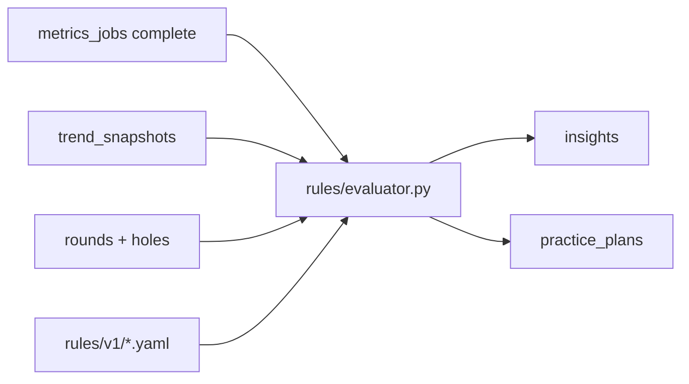

# 05 — Recommendation Engine v1

**Status:** Complete  
**Checkpoint:** CP-5  
**Date:** 2026-05-22  
**Sign-off:** Approved for CP-6 (scaffold) — **design gate complete**

**Depends on:** [04-metrics-engine.md](./04-metrics-engine.md), [03-data-model.md](./03-data-model.md), [02-architecture.md](./02-architecture.md)  
**Rule files:** [rules/v1/rules.yaml](../../rules/v1/rules.yaml), [rules/v1/practice_templates.yaml](../../rules/v1/practice_templates.yaml)  
**Workplan:** [PHASE1_WORKPLAN.md](../PHASE1_WORKPLAN.md#cp-5--recommendation-engine-v1-rules)

---

## 1. Engine decision summary

| Field | Decision |
|-------|----------|
| **Recommendation** | Version-controlled **YAML** rules → Python evaluator in FastAPI → `insights` + `practice_plans` / `practice_plan_items` |
| **Why** | Explainable, testable, editable without redeploying code; matches PRD |
| **Alternatives** | LLM-first coaching — deferred as optional narrative layer (CP-14 P6) |
| **Risks** | Rule fatigue — mitigated with cooldowns, max 3 active insights, priority ordering |
| **Next action** | CP-6 monorepo includes `rules/` package; CP-11 implements evaluator |

---

## 2. Architecture



| Step | Component | Action |
|------|-----------|--------|
| 1 | Analytics job | Finish metrics → write `trend_snapshots` |
| 2 | Evaluator | Load snapshots + hole-level data + YAML rules |
| 3 | Evaluator | Compute **derived metrics** (§5) not stored in snapshots |
| 4 | Evaluator | Evaluate conditions; apply conflict policy (§6) |
| 5 | Evaluator | Insert/update `insights`; create `practice_plans` from templates |
| 6 | BFF | `GET /api/insights`, `GET /api/practice-plans/current` |

Rules run in the **same** `POST /internal/jobs/metrics` job after metrics (ADR-002).

---

## 3. Rule file schema

**Location:** `rules/v1/rules.yaml` (committed; bump `v2` for breaking changes).

```yaml
version: "1"
rules:
  - id: R01                    # unique, stable for cooldown tracking
    enabled: true
    priority: 80               # 1–100, higher = more important
    cooldown_days: 14          # suppress re-fire if active insight exists
    condition:
      type: metric             # metric | derived | round_count | composite
      metric_key: gir_one_putt_pct
      window: last_10
      operator: lt             # lt | lte | gt | gte | eq | delta_gt | delta_lt
      value: 0.75
    insight:
      title: "Short putts costing you"
      body: "Your one-putt rate on GIR holes is below 75% — focus inside 6 feet."
    practice_template_id: short_putt_gate
```

### 3.1 Condition types

| `type` | Description |
|--------|-------------|
| `metric` | Read `trend_snapshots` by `metric_key` + `window` |
| `derived` | Compute from holes (§5); same operators |
| `round_count` | `operator: lt`, `value: 5` on eligible round count |
| `composite` | `all` / `any` of nested conditions (v1 optional; use flat rules in MVP) |
| `delta` | Compare `metric_key` `last_5` vs `last_10` (or prior snapshot) — `operator: delta_gt`, `value: 0.10` |

### 3.2 Operators

| Operator | Meaning |
|----------|---------|
| `lt`, `lte`, `gt`, `gte`, `eq` | Numeric compare to `value` |
| `delta_gt` | Current window minus prior window &gt; `value` |
| `delta_lt` | Current minus prior &lt; `value` (negative = worsening for leaks) |

Percent metrics are stored as **0–100** in evaluator (FIR/GIR) or **0–1** for rates — rules YAML uses **consistent 0–1 fractions** for rates and **0–100** for `fir_pct`/`gir_pct` keys. See §4 mapping table.

---

## 4. Metric inputs for rules

### 4.1 From `trend_snapshots` (CP-4)

| metric_key | Rule usage | Value scale in rules |
|------------|------------|----------------------|
| `scoring_avg` | R16 trend | strokes (absolute) |
| `fir_pct` | R04 | 0–100 |
| `gir_pct` | R03 delta | 0–100 |
| `putting_avg` | R08 | putts per hole |
| `volatility_std` | R15 | strokes std dev |
| `scoring_leak_par3` | R12 | strokes vs par (positive = worse) |
| `scoring_leak_par4` | R12 | same |
| `scoring_leak_par5` | R06, R12 | same |
| `blow_up_rate` | R07, R10 | 0–1 per hole rate |
| `sg_ott` | (future) | per hole |

### 4.2 Derived at evaluation (from `holes`)

| Derived key | Formula (window = last N rounds) | Rules |
|-------------|----------------------------------|-------|
| `gir_one_putt_pct` | % of GIR holes with `putts = 1` | R01 |
| `three_putt_rate` | % holes with `putts >= 3` | R02 |
| `penalties_per_round` | mean(sum(penalty_strokes)) | R05 |
| `double_plus_per_round` | mean(count score >= par+2) | R07 |
| `missed_gir_inside_100y_pct` | % non-GIR par 4/5 where `(score - putts) >= 3` | R09 |
| `sand_save_proxy_pct` | % holes with penalty≥1 and score≤par+1 | R13 |
| `up_and_down_proxy_pct` | % non-GIR holes with score≤par | R14 |
| `back_nine_leak` | mean(holes 10–18 score) − mean(holes 1–9) | R11 |
| `scoring_avg_last3_trend` | each of last 3 round totals strictly increasing | R16 |
| `has_shot_data` | any shots on most recent round | R18 (inverse) |
| `rounds_in_system` | count eligible rounds | R19 |
| `blow_up_holes_last3` | count holes ≥par+3 in last 3 rounds | R10 |
| `volatility_delta_pct` | (vol_last_5 − vol_last_10) / vol_last_10 | R15 |
| `gir_pct_delta` | gir_pct(last_5) − gir_pct(last_10) | R03 |

**MVP proxies (disclose in UI):** R01 uses GIR one-putt % as proxy for “make % inside 6ft”; R09/R13/R14 use scoring patterns without GPS distance.

---

## 5. Conflict resolution & insight policy

| Policy | Rule |
|--------|------|
| **Max active insights** | 3 per user (`status = active`) |
| **Selection** | Sort fired rules by `priority` DESC; take top 3 |
| **Cooldown** | If rule `Rxx` fired within `cooldown_days` and insight still active or not dismissed, skip |
| **Dismissal** | User dismiss → `status = dismissed`; cooldown starts from `fired_at` |
| **R20 maintenance** | Fires only when no R01–R19 conditions match (lowest priority 10) |
| **Practice plan** | One **active** plan; new high-priority insight may supersede (archive prior) |

**Tie-break:** Higher `priority` wins; if equal, lower rule id wins (R01 &lt; R02).

---

## 6. Practice plan templates

**File:** [rules/v1/practice_templates.yaml](../../rules/v1/practice_templates.yaml)

| template_id | Title | Duration |
|-------------|-------|----------|
| `short_putt_gate` | Short Putt Gate Drill | 30 min |
| `lag_putting_ladder` | Lag Putting Ladder | 30 min |
| `wedge_gir_challenge` | Wedge GIR Challenge | 45 min |
| `fairway_finder` | Fairway Finder | 40 min |
| `course_management` | Course Management Session | 60 min |
| `layup_strategy` | Lay-Up Strategy | 45 min |
| `damage_control` | Damage Control Routine | 30 min |
| `putting_clock` | Putting Clock Drill | 35 min |
| `wedge_distance_matrix` | Wedge Distance Matrix | 50 min |
| `mental_reset_tee` | Mental Reset + Tee Strategy | 25 min |
| `stamina_pace` | Stamina & Pace Plan | off-course |
| `par3_tee_selection` | Par 3 Tee Selection | 30 min |
| `bunker_entry` | Bunker Entry Drill | 35 min |
| `chip_to_3ft` | Chipping to 3 Feet | 40 min |
| `consistency_routine` | Consistency Routine | 30 min |
| `full_bag_audit` | Full Bag Audit | 90 min |
| `gapping_session` | Gapping Session | 60 min |
| `shot_tracking_prompt` | Enable Shot Tracking | 5 min |
| `import_onboarding` | Build Your History | 15 min |
| `maintenance_rotation` | Maintenance Rotation | 45 min |

Each template expands to 2–4 `practice_plan_items` in CP-11 (drill steps in YAML `items` array).

---

## 7. Rule library (R01–R20)

Full machine-readable definitions: [rules/v1/rules.yaml](../../rules/v1/rules.yaml).

| ID | Priority | Condition summary | Practice template |
|----|----------|-------------------|-------------------|
| R01 | 85 | `gir_one_putt_pct` &lt; 75% (last_10) | short_putt_gate |
| R02 | 80 | `three_putt_rate` &gt; 15% | lag_putting_ladder |
| R03 | 75 | `gir_pct` delta (last_5 vs last_10) &lt; −10 | wedge_gir_challenge |
| R04 | 70 | `fir_pct` &lt; 45 (last_10) | fairway_finder |
| R05 | 70 | `penalties_per_round` &gt; 2 | course_management |
| R06 | 65 | `scoring_leak_par5` &gt; 1.0 | layup_strategy |
| R07 | 75 | `double_plus_per_round` &gt; 3 | damage_control |
| R08 | 80 | `putting_avg` &gt; 1.89 (≈34/18) | putting_clock |
| R09 | 65 | `missed_gir_inside_100y_pct` &gt; 40% | wedge_distance_matrix |
| R10 | 70 | `blow_up_holes_last3` ≥ 1 | mental_reset_tee |
| R11 | 60 | `back_nine_leak` &gt; 2.0 | stamina_pace |
| R12 | 60 | `scoring_leak_par3` &gt; `avg(par4,par5)` + 0.5 | par3_tee_selection |
| R13 | 55 | `sand_save_proxy_pct` &lt; 20% | bunker_entry |
| R14 | 65 | `up_and_down_proxy_pct` &lt; 30% | chip_to_3ft |
| R15 | 55 | `volatility_delta_pct` &gt; 20% | consistency_routine |
| R16 | 80 | Last 3 round scores strictly increasing | full_bag_audit |
| R17 | 50 | `sg_app` &lt; −0.3 (last_10) | gapping_session |
| R18 | 40 | Latest round has zero shots | shot_tracking_prompt |
| R19 | 95 | `rounds_in_system` &lt; 5 | import_onboarding |
| R20 | 10 | No R01–R19 fired | maintenance_rotation |

**R19 note:** High priority so new users see onboarding first; capped by max-3 policy alongside scoring insights once data exists.

**R08 threshold:** `putting_avg > 34/18` → **1.89** putts/hole.

**R12:** Composite: `scoring_leak_par3 > (scoring_leak_par4 + scoring_leak_par5) / 2 + 0.5` — implemented as derived `par3_vs_par45_leak` in evaluator.

---

## 8. Persistence mapping

### 8.1 `insights` row

| Field | Source |
|-------|--------|
| `rule_id` | `R01`…`R20` |
| `title`, `body` | YAML `insight` |
| `priority` | YAML `priority` |
| `status` | `active` on fire |
| `cooldown_until` | `fired_at + cooldown_days` |
| `context` | JSON: metric values, window, derived inputs |

### 8.2 `practice_plans` row

| Field | Source |
|-------|--------|
| `title` | Template title |
| `source_insight_id` | FK to insight |
| `status` | `active` |
| Items | Template `items[]` → `practice_plan_items` |

---

## 9. Dry-run examples

### Persona 1 — New user (3 rounds)

| Input | Value |
|-------|-------|
| rounds_in_system | 3 |
| gir_pct last_10 | 42 |
| fir_pct | 38 |

**Fires:** R19 (onboarding), R04 (FIR), R03 if delta &lt; −10 — **top 3 by priority:** R19 (95), R04 (70), R03 (75) → **R19, R03, R04**

### Persona 2 — Putting woes

| Input | Value |
|-------|-------|
| rounds | 10 |
| three_putt_rate | 0.18 |
| putting_avg | 2.0 |
| gir_one_putt_pct | 0.62 |

**Fires:** R02, R08, R01 — **top 3:** R01 (85), R02 (80), R08 (80) → **R01, R02, R08**

### Persona 3 — Stable mid-handicap

| Input | All R01–R19 | false |
| rounds | 12 |

**Fires:** R20 only → maintenance_rotation plan

### Persona 4 — Blow-ups + penalties

| Input | Value |
|-------|-------|
| blow_up_holes_last3 | 2 |
| penalties_per_round | 2.5 |
| double_plus_per_round | 3.5 |

**Fires:** R10, R05, R07 — **top 3:** R07 (75), R10 (70), R05 (70)

---

## 10. CP-5 exit criteria

- [x] 20 rules documented with thresholds (§7 + YAML)
- [x] 4 dry-run personas (§9)
- [x] Practice template library (10 templates, §6)
- [x] **Design gate:** CP-1–CP-5 complete → CP-6 allowed

---

## 11. Open items for CP-6 / CP-11

| Item | Owner |
|------|-------|
| `services/analytics/rules/evaluator.py` | CP-11 |
| Pytest: YAML load + persona dry-runs | CP-11 |
| Copy `rules/` into monorepo layout | CP-6 |
| LLM narrative on top of insights | Post-MVP |

---

## 12. Approval

| Role | Name | Date |
|------|------|------|
| Product / engineering | Wilson Papilla | 2026-05-22 |

**Approved** — proceed to **CP-6** (monorepo scaffold).
